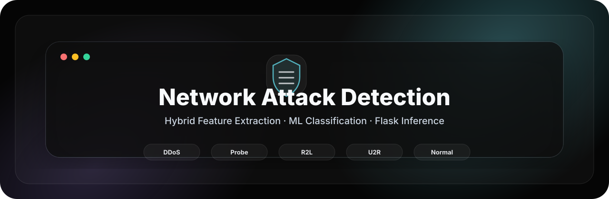
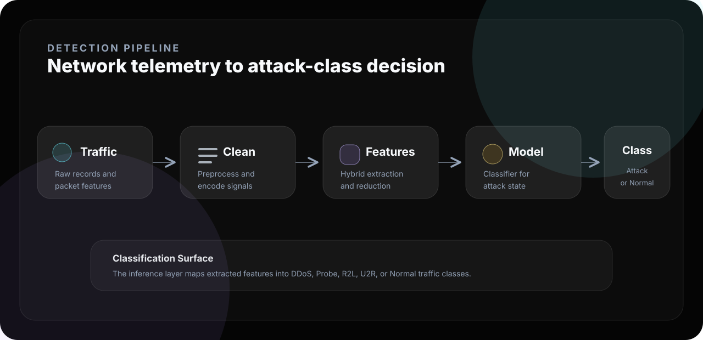
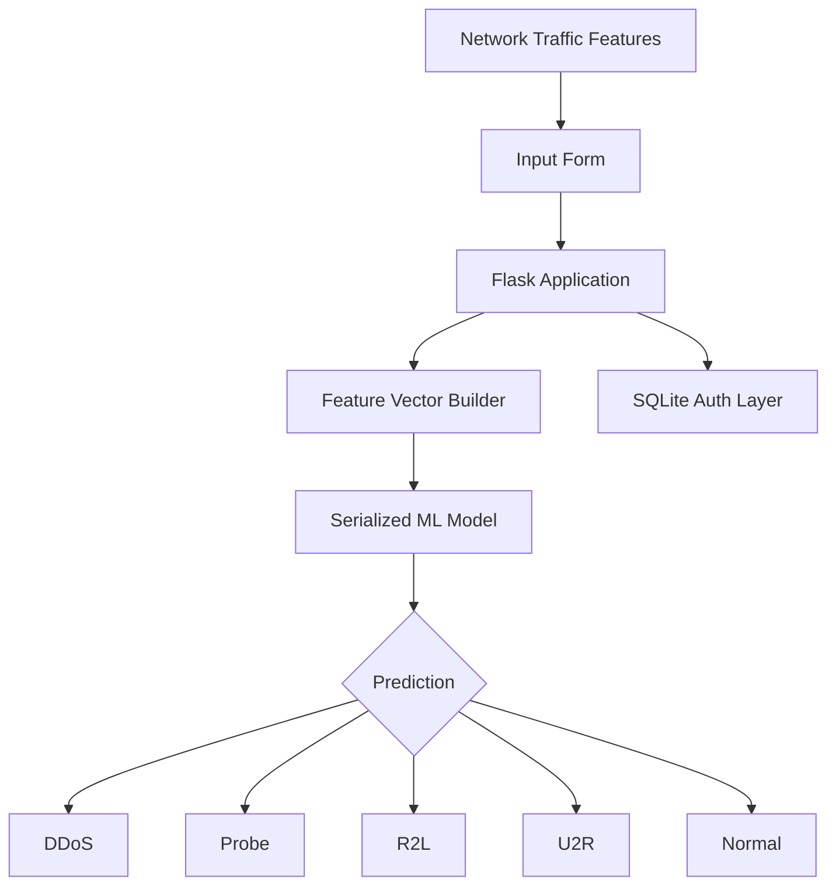
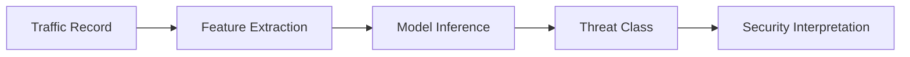
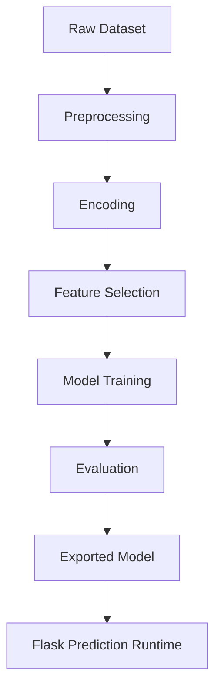

<div align="center">



<br />

<p>
  <strong>Extract signals.</strong> <strong>Classify behavior.</strong> <strong>Detect network threats.</strong>
</p>

<p>
  
  
  
  
</p>

</div>

---

<div align="center">

<table>
<tr>
<td align="center" width="20%"><strong>DDoS</strong><br />Traffic Flooding</td>
<td align="center" width="20%"><strong>Probe</strong><br />Reconnaissance</td>
<td align="center" width="20%"><strong>R2L</strong><br />Remote Access</td>
<td align="center" width="20%"><strong>U2R</strong><br />Privilege Escalation</td>
<td align="center" width="20%"><strong>Normal</strong><br />Benign Traffic</td>
</tr>
</table>

</div>

---

## 01 · Overview

<table>
<tr>
<td width="58%" valign="top">

### ML-powered network intrusion classification

This repository implements a machine learning based network attack detection system with a Flask inference interface. It classifies traffic into multiple security states, including DDoS, Probe, R2L, U2R, and Normal.

The project is positioned as a compact research-engineering prototype for feature-driven network threat analysis and browser-based prediction.

</td>
<td width="42%" valign="top">

```text
┌──────────────────────────────┐
│  NETWORK DETECTION CONSOLE   │
├──────────────────────────────┤
│  Input      Traffic Features │
│  Process    Feature Vector   │
│  Model      ML Classifier    │
│  Output     Attack Class     │
│  UI         Flask App        │
└──────────────────────────────┘
```

</td>
</tr>
</table>

---

## 02 · Detection Pipeline



---

## 03 · System Architecture



---

## 04 · Key Features

| Feature | Purpose |
|---|---|
| Multi-class classification | Detects DDoS, Probe, R2L, U2R, and Normal traffic states. |
| Flask inference UI | Provides a browser-based interface for traffic feature prediction. |
| Serialized model runtime | Loads a trained model artifact for inference. |
| Authentication flow | Includes SQLite-backed signup/signin workflow. |
| Research workflow | Supports ML experimentation, feature analysis, and classification validation. |
| Security-focused output | Converts numerical traffic inputs into human-readable threat states. |

---

## 05 · Threat Analysis Flow



| Class | Meaning |
|---|---|
| DDoS | High-volume traffic behavior intended to disrupt service availability. |
| Probe | Reconnaissance-style behavior used to discover network weaknesses. |
| R2L | Remote-to-local access attempt pattern. |
| U2R | User-to-root privilege escalation pattern. |
| Normal | Benign traffic behavior. |

---

## 06 · ML Workflow



| Stage | Output |
|---|---|
| Preprocessing | Clean and normalized network features. |
| Feature extraction | Detection-ready numerical vectors. |
| Training | Supervised model for attack-class prediction. |
| Evaluation | Accuracy, precision, recall, F1-score, confusion matrix. |
| Inference | Browser-based prediction through Flask. |

---

## 07 · Installation

```bash
git clone https://github.com/ns7523/Network-attacks-detection.git
cd Network-attacks-detection
python -m venv .venv
source .venv/bin/activate
pip install flask pandas numpy scikit-learn joblib matplotlib seaborn
```

---

## 08 · Usage

Run the Flask application:

```bash
python app.py
```

Open the local interface:

```text
http://127.0.0.1:5000
```

Submit the required network traffic feature values through the prediction form. The model returns a traffic classification result.

---

## 09 · Project Structure

```text
.
├── assets/
│   └── brand/
│       ├── hero.svg
│       └── pipeline.svg
├── app.py
├── model.sav
├── signup.db
├── templates/
├── static/
└── README.md
```

Suggested production structure:

```text
docs/ · src/ · models/ · data/ · results/ · notebooks/ · assets/screenshots/ · requirements.txt
```

---

## 10 · Visual Assets

<table>
<tr>
<td width="50%" valign="top">

### Prediction Interface

`assets/screenshots/prediction-form.png`

Traffic feature input interface.

</td>
<td width="50%" valign="top">

### Classification Result

`assets/screenshots/classification-result.png`

Output view showing the predicted network state.

</td>
</tr>
<tr>
<td width="50%" valign="top">

### Metrics View

`assets/screenshots/model-metrics.png`

Confusion matrix, precision, recall, and F1-score.

</td>
<td width="50%" valign="top">

### System Architecture

`assets/screenshots/system-architecture.png`

Clean visual map of the detection system.

</td>
</tr>
</table>

---

## 11 · Security Notes

- Move credentials and mail configuration into environment variables.
- Hash stored passwords before any production-style deployment.
- Validate form input before model inference.
- Add dependency pinning through `requirements.txt`.

---

## 12 · Future Improvements

- [ ] Add reproducible training notebook.
- [ ] Add `requirements.txt`.
- [ ] Move ML and Flask code into `src/`.
- [ ] Add confusion matrix and classification report.
- [ ] Add Docker support for isolated runtime.
- [ ] Add screenshots under `assets/screenshots/`.
- [ ] Add a formal open-source license.

---

<div align="center">

### N S Akash

**AI & Cybersecurity Engineer**

<p>
  <a href="https://github.com/ns7523"></a>
  <a href="https://nsakash.in"></a>
  <a href="mailto:contact@nsakash.in"></a>
  <a href="https://www.linkedin.com/in/nsakash7523"></a>
</p>

</div>